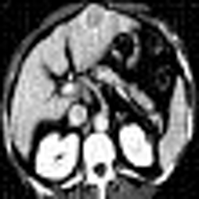



- Instrucciones de compilación con GCC:

  Para compilar el programa se debe ejecutar g++ de la siguiente manera:

  > g++ -std=c++11 main.cpp sparse_matrix.cpp matrix.cpp vector.cpp -o tp3

  Se recomienda además incluir el flag de optimización -o3 para obtener mejores tiempos de ejecución.

- Instrucciones de uso:

  El programa solo acepta imágenes cuadradas en formato CSV, con intensidades de píxeles en el rango [0,255].

  El formato de uso es el siguiente:

  > ./tp3 \<input> \<output> \<tamañocelda> \<metodo> \<nivel de ruido 1> \<nivel de ruido 2> ... \<nivel de ruido N>

  A continuación se detallan cada uno de los parámetros:

   \<input>: nombre del archivo CSV de entrada.

   \<output>: nombre del archivo CSV de salida. Aquí será guardada la imagen reconstruida.

   \<tamanocelda>: ancho/alto, en píxeles, de las celdas cuadradas de la discretización.

   \<metodo>: entero que identifica el método de generación de rayos a utilizar.
      0: método completo, se generan todos los rayos posibles que vaya de un lado de la imagen al lado opuesto.
      1: método de rayos verticales, horizontales y diagonales de pendiente uno.
      2: método de rayos que barren la imagen desde las cuatro esquinas.
      Si se especifica un valor mayor a 2 se entiende como la cantidad de rayos aleatorios a generar.

   \<nivel de ruido 1, 2 ... N>: son todos los niveles de ruido (punto flotante) con los cuales se reconstruirá la imagen. Por cada nivel, el nombre
  del archivo de salida será el indicado por el argumento \<output> más un sufijo que es el nivel de ruido con el cual se generó.

  Ejemplos de uso:

  - Para reconstruir la imagen tomo.csv con celdas de tamaño 5, usando el método de rayos verticales, horizontales y diagonales, con nivel de
    ruido 55.5, correr:

    > ./tp3 tomo.csv tomo_out.csv 5 1 55.5

    Esto genera un archivo de salida tomo_out_55.5.csv con la imagen reconstruida.

  - Para reconstruir la imagen tomo3.csv con celdas de tamaño 10, usando 10000 rayos aleatorios, con niveles de ruido 100.0, 200.0 y 500.0, correr:

    > ./tp3 tomo3.csv output.csv 10 10000 100.0 200.0 500.0

    Esto genera tres archivos de salida, output_100.0.csv, output_200.0.csv y output_500.0.csv.

_______________________________________________________________________

Este fue un trabajo para la materia Métodos numéricos, por Damián Huaier, Mateo Marenco, Daniel Salvia y Ezequiel Togno
